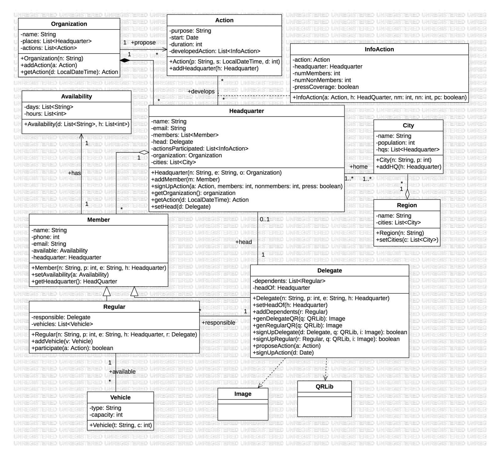

# Lab 3 report

## 1. Introduction

The aim of this report is to describe how we have done lab 3, including all the problems we encountered and our solutions. First of all, our goal for this lab is to implement an application using libraries and inheritance. By using the design of Seminar 3, we are going to implement an organization management application. Similar to the previous lab, this time we are given a directory src with definition of several classes and some XML files. We are also given the class Utility which contains a generic static method getObject, QRLib and Image classes with two static methods generateQRCodeImage and decodeQRCodeImage for creating and decoding QR Images. For our part, we need to create 11 classes corresponding to the design diagram, which are *Organization, Action, Availability, Headquarter, InfoAction, City, Region, Member, Regular, Delegate and Vehicle*. Finally, we create a *TestDelegate* class which includes the main method.

The UML of the program is defined as follows:




## 2. Implementation

In the explanation of the implementation of this Lab3, we will not go through all the existing classes/methods because some of them are just to simple and are not worth-mentioning. We will just mention some of the essential aspects of the code.

First of all, we follow the instructions of the teacher during the lab session to configure the classpath. Then, as usual, we include all the attributes and methods corresponding to the design diagram. There are no difficulties during this step. However, we need to take into account when to use linked lists and when to pass the element itself. When the cardinality is 1, for example, each headquarter can only belong to 1 organization, then we use the element organization itself. On the other hand, the organization can have many headquarters, then we need to pass a list of headquarters since the cardinality is higher than 1.

### ***Reading the XML files***

It is implemented in a similar way to the previous Lab. We have created LinkedLists and isinstances to store the information retrieved from the xml files. Variables *cities, headquarters and delegates* are not crutial since all information can be stored in merely variables *regions and organization*; however, the existece of these can simplify a lot the process of code testing, so that is why we have incorporated these.

```java
LinkedList<Region> regions = new LinkedList<Region>();
LinkedList<City> cities = new LinkedList<City>();
Organization organization = new Organization("Lab3 Organization");
LinkedList<Headquarter> headquarters = new LinkedList<Headquarter>();
LinkedList<Delegate> delegates = new LinkedList<Delegate>();
```

Following is an example of how the program reads the file *regions.xml*

```java
LinkedList<String[]> xmlRegions = Utility.readXML("region");
for (String[] reg: xmlRegions){ 
    LinkedList<City> regionCities = new LinkedList<City>();
    Region tempReg = new Region(reg[0]);
    String[] tempCities = Arrays.copyOfRange(reg, 1, reg.length/2+1);
    String[] tempPopulation = Arrays.copyOfRange(reg, reg.length/2+1, reg.length);
    for (int i =0; i<tempCities.length; i++){
        City tempCity = new City(tempCities[i], Integer.parseInt(tempPopulation[i]));
        cities.add(tempCity);
        regionCities.add(tempCity);
    }

    tempReg.setCities(regionCities);
    regions.add(tempReg);
}
```

### ***Organization Class***

The method getAction with return an Action with a given date. If there does not exist any action that will be held in the given date, the method will return a null pointer.
```java
public Action getAction(Date d) {
    for (int i = 0; i<this.actions.size(); i++){
        if (actions.get(i).getDate().equals(d)){
            return actions.get(i);
        }
    }
    return null;
}
```

The method getDelegates() returns a list of the head-delegates of each headquarter belonging to the organization. The program will go through all the headquarters since each headquarter has a delegate who is the head of the headquarter. 

```java
public LinkedList<Delegate> getDelegates(){
    LinkedList<Delegate> out = new LinkedList<Delegate>();
    for (Headquarter h : this.places){
        out.add(h.getHead());
    }
    // Print it with System.out.println(Utility.toString(out));
    return out;
}
```

Similarly, the method getAllMembers() which returns the list of members also goes through all the headquarters of the organization and access the members of each headquarter then save them into the linked list.

```java
public LinkedList<Member> getAllMembers(){
    LinkedList<Member> out = new LinkedList<Member>();
    for (Headquarter h : this.places){
        out.addAll(h.getMembers());
    }
    // Print it with System.out.println(Utility.toString(out));
    return out;
}
```

These are support methods to be used in the code testing part, along with the methods getActions() and getAllInfoActions()

```java
public LinkedList<Action> getActions(){
    return this.actions;
}

public LinkedList<InfoAction> getAllInfoActions(){
    LinkedList<InfoAction> out = new LinkedList<InfoAction>();
    for (Action a : this.actions){
        out.addAll(a.getDevelopedAction());
    }
    // Print it with System.out.println(Utility.toString(out));
    return out;
}
```

### ***Delegate Class***

Both actions genDelegateQR and genRegularQR are almost identical. They start by creating an instance of the Image with a specified output path (where the image will be stored). After that, they create a QRcode with a text that includes the name of the delegate that generates the QR code and a specific message (this message is the one that differs DelegateQRs and RegularQRs). Finally, the created BitMatrix (mainly the QR code) is saved in the image and this is returned.

```java
public Image genDelegateQR(QRLib q){
    Image out = new Image("Lab3/genDelegateQR"+headOf+".png", 200, 200);
    String text = this.toString();
    text = text + ". This is a QR for a Delegate Member. You don't have to care about rising sea levels, if you live on a mega yatch.";
    BitMatrix b = QRLib.generateQRCodeImage(text, 200, 200);
    out.setBitMatrix(b);
    out.save();
    return out;
}

public Image genRegularQR(QRLib q){
    Image out = new Image("Lab3/genRegularQR"+headOf+".png", 200, 200);
    // We will include the name of the delegate at the begginning of the text (followed by a dot), so it will be easier for further methods to be done
    String text = this.toString();
    text = text + ". This is a QR for a Delegate Member. Climate change doesn't matter, if you stay indoors.";
    BitMatrix b = QRLib.generateQRCodeImage(text, 200, 200);
    out.setBitMatrix(b);
    out.save();
    return out;
}
```

The two next methods are signUpDelegate and signUpRegular allowing to sign up delegate or regular members to the organization. When a member is added, we need to check for the text of the given QRcode ; if there is no text, the given QRcode would be considered invalid and hence no member would be added. In addition to that, the method also has to check that the sign up message corresponds to its puspose; that is, a regular member QRcode can not be used to sign up a delegate member and viceversa.
Also, the given member's headquarter's head must be the same name than the one displayed in the image; this will ensure that the one who created the QRcode is precisely the head (Delegate) of the headquarter where the member wants to sign up.

```java
public boolean signUpDelegate(Delegate d, QRLib q, Image i){
    String text = QRLib.decodeQRCodeImage(i.getBitmap());
    String delText = " You don't have to care about rising sea levels, if you live on a mega yatch";
    if (text!=null){
        // Get the delegate name that is in the image text
        String iDelegate = text.split("[.]")[0];
        // If the second part of the text is not the same text required for signing up a delegate member, return false
        if (text.split("[.]")[2].equals(delText) == false) {return false;}
        // Check if the name is essentially the name of the head of the headquarter where the member wants to sign up
        if (d.getHeadquarter().getHead().toString().equals(iDelegate)){
            d.getHeadquarter().setHead(d);
            return true;
        }
        // If not, return false -> the program does not add the member
        return false;
    }
    return false;
}

public boolean signUpRegular(Regular r, QRLib q, Image i){
    String text = QRLib.decodeQRCodeImage(i.getBitmap());
    String regText = " Climate change doesn't matter, if you stay indoors";
    if (text!=null){
        // Get the delegate name that is in the image text
        String iDelegate = text.split("[.]")[0];
        // If the second part of the text is not the same text required for signing up a regular member, return false
        if (text.split("[.]")[2].equals(regText) == false) { 
            return false;}
        // Check if the name is essentially the name of the head of the headquarter where the member wants to sign up
        if (r.getResponsible().toString().equals(iDelegate)){
            r.getResponsible().getHeadquarter().addMember(r);
            return true;
        }
        // If not, return false -> the program does not add the member
        return false;
    }
    return false;
}
```

The method proposeAction will add a new action to the list of actions of the organization.

```java
public void proposeAction(Action a){
    this.headOf.getOrganization().addAction(a);
}
```

The method signUpAction will check first if there exists an action with a given date, if there is not, it will not do anything besides printing a message in the output. If there exists an action in the given date, this method will make use of another existing method (Action.addHeadquarter()) in order to sign up.

```java
public void signUpAction(Date d){
    if (this.headOf.getOrganization().getAction(d)!=null){
        this.headOf.getOrganization().getAction(d).addHeadquarter(headOf);
    } else {
        System.out.println("There does not exist any action with date " + d.toString());
    }
    }
```

### ***Headquarter Class***

Method signUpAction() will create an instance of InfoAction and will add this to the LinkedList in the Action class and the Headquarter class itself.

```java
public void signUpAction(Action a, int members, int nonMembers, boolean press){
    InfoAction tempInfoAction = new InfoAction(a, this, members, nonMembers, press);
    this.actionsParticipated.add(tempInfoAction);
    a.addInfoAction(tempInfoAction);
}
```

The getAction method will try to return an action that will happen at a given date, if the method does not find any action, it will return null.

```java
public Action getAction(Date d){
    for (int i = 0; i<this.actionsParticipated.size(); i++){
        if (actionsParticipated.get(i).getAction().getDate().equals(d)){
            return actionsParticipated.get(i).getAction();
        }
    }
    return null;
}
```

### ***Regular Class***

Method participate will return a boolean indicating if the headquarter that the member belongs does or does not participate in a given action.

```java
public boolean participate(Action a){
    // Checks if a regular member's associated headquarter participates in a given action
    Headquarter h = this.getHeadquarter();
    Date tempDate = a.getDate();
    if (h.getAction(tempDate)!=null){return true;}
    return false;
}
```

## 3. Conclusion

After the execution, there are no compilation errors. We were able to implement the structure of the organization and the territory, including the functionalities that allow to sign up new members and actions.

There is a section named "Code Tesing" in the *TestDelegate* file. Just uncomment these lines to verify that the methods described can be implemented correctly.

Regarding the given source code (*Utility.java*), we have changed the file directory, if it does not work on your computer, please change the path according to your precise situation. Following is the line of code we have modified.

```java
File input = new File("Lab3/src/" + type + "s.xml"); // Modified manually
```